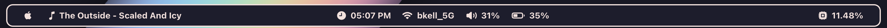

# hi there

## sketchybar

based on [slano-ls' dotfiles configs](https://github.com/slano-ls/SketchyBar), with screenshot of the original bar above.
### how to
1. get [homebrew](https://brew.sh)
2. install [sketchybar](https://github.com/FelixKratz/SketchyBar)
3. git clone my configuration
```bash
git clone https://github.com/strwbzzy/dotfiles ~/.config/sketchybar/
```
